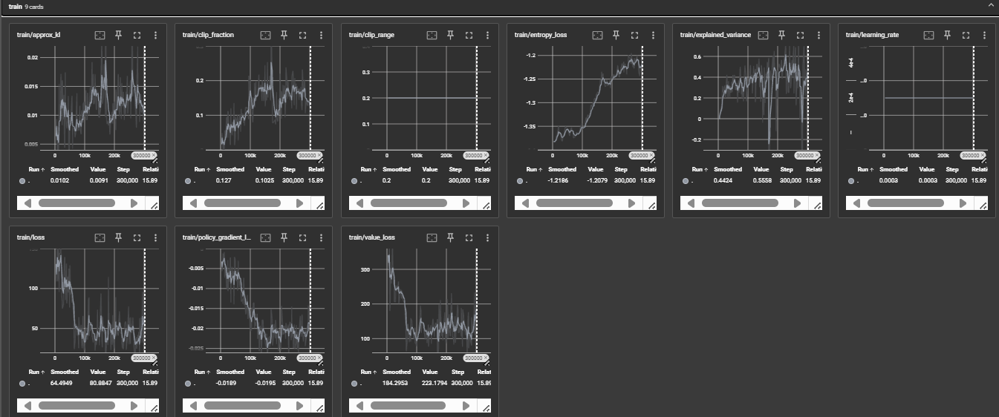

# Snake DRL Mini‑Project (Gymnasium + Stable‑Baselines3)

SNAKE THING I ROBBED THE FLAPPY BIRD

* Ready‑to‑run **training**, **evaluation**, and **(optional) visualization** scripts.
* Clear places to inject **faults/bugs** for testing objectives.

---

## 1) Quickstart

```bash
# 1) Create & activate a fresh venv (recommended)
python3 -m venv .venv && source .venv/bin/activate  # (Windows: .venv\Scripts\activate) activate.bat

# 2) Install deps
pip install --upgrade pip
pip install gymnasium stable-baselines3[extra] pygame numpy tensorboard
pip install tensorflow
pip install tensorboard

# 3) Save the files below into the same folder, then train. choose mode if needed (length or survival):
python train.py --timesteps 200000 --reward_mode length --seed 7

# 4) Evaluate the trained agent ()
python eval.py --model_path models/ppo_snake_{mode} --reward_mode {mode} --episodes 10 --render 0 --json_out logs/{mode}_eval.json

# (Optional) Watch a live episode with rendering, chooose mode as needed (ppo_snake_{mode}). best_model is saved in the same models folder
python visualize.py --model_path models/ppo_snake_{mode} --fps 60 

```

**Folder layout (created at runtime):**

```
./
  snake_env.py
  train_a2c.py
  train_ppo.py
  eval.py
  visualize.py
  models/
  logs/
  newModels/
  oldVersions
  src/
  configs/
```

---

## 2) The Environment: `snake_env.py`

Key ideas:


* Discrete(4) actions: **0=Up**, **1=Down**, **2=Left**, **3=Right**
* Observation = Genuinely don't know
* Termination on **collision**; truncation on **max\_steps** (episode cap).
* Two reward modes:

  * `survival`: +0.1 per step alive, -50.0 for collision, −0.5 for being within 3 tiles of a wall. Goes in Circles to ensure surviving for maximum time
  * `length`: Wants to eat apples.


> **Where to inject faults (for testing):**
> Change window parameters and add additional objects to collide with


## TensorBoard

1. **Make sure you logged during training**
   In the training script (`train.py`) you already had:

   ```python
   from stable_baselines3.common.logger import configure
   new_logger = configure("./logs", ["stdout", "tensorboard"])
   model.set_logger(new_logger)
   ```

   That means logs (scalars, rewards, losses, etc.) are written into the `./logs/` folder.

2. **Launch TensorBoard** from your project root:

   ```bash
   python -m tensorboard.main --logdir logs/{session}
   ```

   By default it serves on `http://localhost:6006`.

3. **Open in browser**
   Go to [http://localhost:6006](http://localhost:6006). You’ll see tabs like *Scalars*, *Graphs*, *Histograms*.

   * Under **Scalars**, you can track:

     * `rollout/ep_rew_mean` → average episode reward
     * `rollout/ep_len_mean` → average episode length
     * `train/policy_loss`, `train/value_loss` → training losses
     * `time/fps` → training speed

4. **Multiple runs**
   If you train with different configs (e.g., PPO vs A2C, survival vs coverage rewards), point them to different subfolders under `logs/` (e.g., `logs/ppo_survival/`, `logs/a2c_coverage/`). TensorBoard will let you overlay/compare them.


# Artifacts, screenshots, oldVersions, newModels

## oldVersions 

are saved models from when the environment was 720x360 (window size was reduced to 300x200 to make training easier)

## newModels

models saved from the new 300x200 environment

### artifacts

e

### bestModels

e

# Observations and analysis



I have no clue what I'm doing